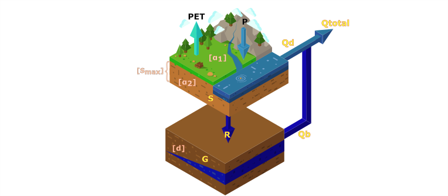

<!-- README.md is generated from README.Rmd. Please edit that file -->
[](https://travis-ci.com/dazamora/DWBmodelUN)

DWBmodelUN
==========

The R package Modelling aims to implement Dynamic Water Balance model proposed by L. Zhang et al. (2008) in a monthly time step. It is a tool for hydrologic modelling using the Budyko Framework and the Dynamic Water Balance Model, with DDS Tolson and Shoemaker (2007) algorithm to calibrate the model and analyze the outputs.

Instalation
-----------

Currently, you can install the version under development from [Github](https://github.com/dazamora/DWBmodelUN), using these commands:

``` r
install.packages("devtools")
devtools::install_github("dazamora/DWBmodelUN")
```

Concepts behind DWBmodelUN
--------------------------

Two physical laws are taken into account in Dynamic Water Balance model (DWB), mass balance and energy balance. To represent the mass conservation, DWB is based on the equilibrium of water balance shown in equation (1).


Where *S*<sub>*c*</sub> is the total stored water in the basin, *P* is the precipitation, *ET* is actual evapotranspiration, *R* corresponds to surface runoff and *Q* to aquifers recharge. To evaluate the water balance of a basin is necessary to know several kind information like climatic variables, basin physical characteristics and further uniqueness relationships of each study. In the case of water balance models, some information can be replaced by equations and mathematical relations physically based, which makes the models much simpler but functional.

To represent energy conservation the model includes a conceptualization made by Budyko (1961) where the energy availability influences over the atmospheric water demand which is represented by potential evapotranspiration (*PET*). The conceptualization also states that the dominant control of the water balance is atmospheric demand and water availability (P), which impose a limit to how much water can be evapotranspirated. L. Zhang et al. (2008) worked on the mathematical assumption presented by Baw-Puh (1981) (equation 2) that is a continuation of Budyko framework.


Where *α* is a model parameter with an interval of \[0-1\]. L. Zhang et al. (2008) detailed the influence of α parameter on the hydrological response in their model DWB. DWB is a lumped conceptual hydrological model developed for annual and monthly time step. The model inputs are precipitation, potential evapotranspiration and streamflow. In general terms, DWB calculates the streamflow using two tanks and doing the following processes:

1.  Precipitation is partitioned to basin water consumption and basin water yield. When it rains the soil is replenished and part of the rainfall is returned to the atmosphere, this process corresponds to basin water consumption, by the other hand, the remaining rainfall is the basin water yield.
2.  Total water available for evapotranspiration is divided into water remaining in the soil storage and actual evapotranspiration.
3.  The basin water yield is divided into surface runoff and water that supplies the groundwater store.
4.  The base flow is the result of groundwater storage drainage.
5.  The total monthly flow is the result of adding base flow and surface runoff.



All these processes are done under the Top Down approach consider only four parameters are added to the model structure: *α*<sub>1</sub>, precipitation catchment efficiency; *α*, evapotranspiration efficiency; *d*, groundwater store time constant; *S*<sub>*m**a**x*</sub>, maximum water holding capacity of soil store (L. Zhang et al. (2008)).

DWBmodelUN functions
--------------------

DWBmodelUN package contains 12 functions, most of them have a practical example about their usage. The functions are:

-   `BuildGRUmaps`: This function builds raster maps for each parameter based on a raster file where the location of the Grouped Response Units (GRUs) are defined.
-   `cellBasins`: This function identifies the cells that are within a basin.
-   `Coord_comparison`: This function compares three characteristics from two rasters:coordinates, resolution, and number of layers
-   `dds`: This function allows the user to calibrate the DWB or other models with the Dynamical Dimension Search (DDS) algorithm (Tolson and Shoemaker (2007)).
-   `DWBCalculator`: The function performs the distributed DWB hydrological model calculations in the defined domain and time period.
-   `funFU`: Fu's function for relationship between precipitation and potential evapotranspiration.
-   `graphDWB`: This function dynamically graphs the inputs and results of the Modelling. It has four types of graphs.
-   `init_state`: This function uploads or creates the initial conditions of the two-state variables present in the DWB model, in raster format.
-   `printVar`: This function that allows to print some of the variables simulated by the DWB model.
-   `readSetup`: This function reads the setup features of the model. These include the dates that define the simulated time period, and also the variables that will be printed in individual directories
-   `upForcing`: This function loads the precipitation and evapotranspiration estimates that will be used to run or force the DWB model
-   `varBasins`: This function retrieves the value of a variable in each of the cells that are within a basin boundary. It also returns the time series average value of the variable.

Datasets
--------

DWBmodelUN also contains 11 data that allow to run the practical examples (Duque (2018)):

-   `basins`: The polygons of the 23 subbasins accross the Sogamosos Basin.
-   `cells`: Coordinates (Latitud and Longitud) and ID number of cells in Sogamoso River Basin.
-   `dwb_results`: Results from DWB in Sogamoso River Basin.
-   `EscSogObs`: Flow rates observed in Sogamoso River Basin at 32 gauges from January 2001 to December 2016.
-   `GRU`: Raster data of Group Response Units in Sogamoso River Basin
-   `param`: Values to four parameters *alpha\_{1}*, *alpha\_{2}* *d*, *S\_{max}* of DWB model in each GRU.
-   `PET_sogamoso`: Distributed monthly potential evapotranspiration in Sogamoso River Basin from January 2001 to December 2016.
-   `setup_data`: Data.frame with the initial configuration of the model run.
-   `simDWB.sogamoso`: Simulated runoff by the DWBmodelUN in the same stations where there were observed data from the Sogamoso basin.
-   `sogamoso`: Sogamoso River Basin data.
-   `P_sogamoso`: Distributed monthly precipitation in Sogamoso River Basin from January 2001 to December 2016.
-   `r.cells`: Data.frame with the initial configuration of the model run.

References
----------

Baw-Puh, Fuh. 1981. “On the Calculation of the Evaporation from Land Surface \[J\].” *Chinese Journal of Atmospheric Sciences* 1.

Budyko, Mikhail Ivanovich. 1961. “The Heat Balance of the Earth’s Surface.” *Soviet Geography* 2 (4). Taylor & Francis: 3–13.

Duque, Nicolás. 2018. “Estimación de Campos de Precipitación En Cuencas Hidrográficas Colombianas Con Escasez de Datos, Combinando Datos Teledetectados Y de Estaciones En Tierra, Utilizando Funciones de Kernel.” Master’s thesis, Universidad Nacional de Colombia - Sede Bogotá. <http://bdigital.unal.edu.co/71663/>.

Tolson, Bryan A, and Christine A Shoemaker. 2007. “Dynamically dimensioned search algorithm for computationally efficient watershed model calibration” 43: 1–16. doi:[10.1029/2005WR004723](https://doi.org/10.1029/2005WR004723).

Zhang, Lu, Nick Potter, Klaus Hickel, Yongqiang Zhang, and Quanxi Shao. 2008. “Water balance modeling over variable time scales based on the Budyko framework - Model development and testing.” *Journal of Hydrology* 360 (1-4): 117–31. doi:[10.1016/j.jhydrol.2008.07.021](https://doi.org/10.1016/j.jhydrol.2008.07.021).
